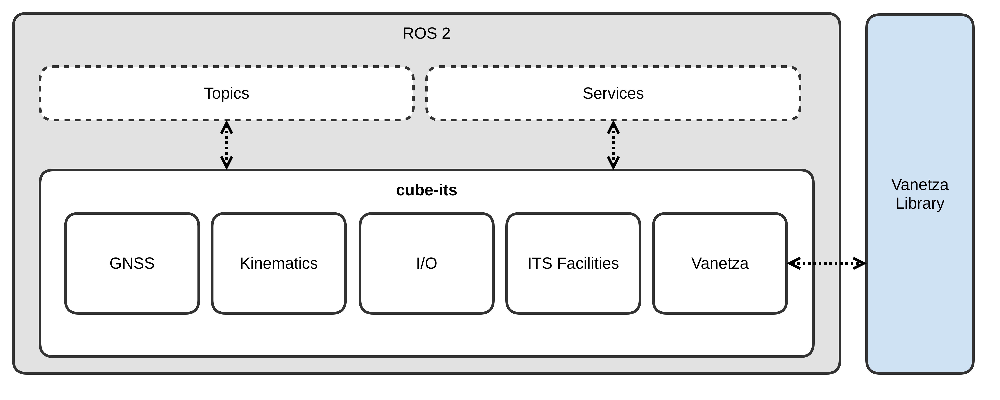
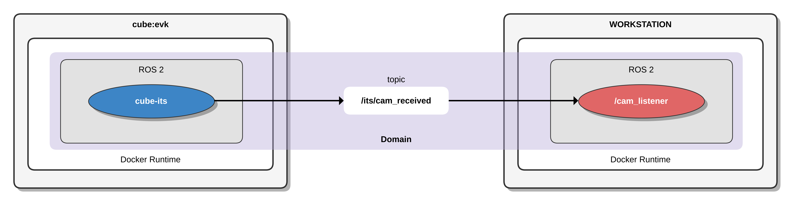
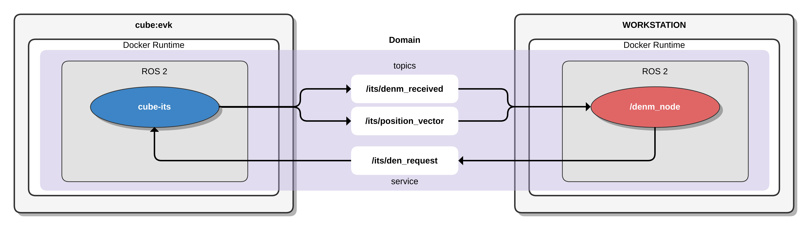
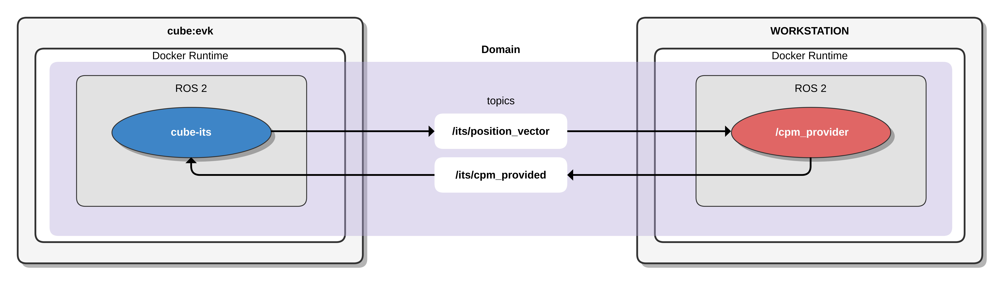

# Develop and run a sample application for cube-its

This repository provides examples demonstrating how to develop and run your own V2X (Vehicle-to-Everything) application on the *cube-its* within a [ROS 2 (Robot Operating System)](https://www.ros.org/) environment. The content is structured as follows: 

1. [cube-its](#cube-its)
   - 1.1 [Component description](#component-description)
   - 1.2 [Compatible ETSI ITS messages](#compatible-ETSI-ITS-messages)
   - 1.3 [Conformance validation](#conformance-validation)
   - 1.4 [Supported applications](#supported-applications)
2. [ROS 2](#ros-2)
   - 2.1 [Node visibility](#node-visibility)
3. [Prerequisites](#prerequisites)
4. [Code examples](#code-examples)
   - 4.1 [Cooperative Awareness Message (CAM)](#cooperative-awareness-message)
   - 4.2 [Decentralized Environmental Notification Message (DENM)](#decentralized-environmental-notification-message)
   - 4.3 [Collective Perception Message (CPM)](#collective-perception-message)
   - 4.4 [Vulnerable Road User Awareness Message (VAM)](#vulnerable-road-user-awareness-message)
   - 4.5 [Stationary Vehicle Warning (StVeWa)](#stationary-vehicle-warning-trigger)
5. [Build and run nodes](#build-and-run-nodes)
6. [Real-world deployments](#real-world-deployments)

---

## cube-its   

The **cube-its** framework is designed to seamlessly integrate Intelligent Transportation Systems (ITS) applications and Vehicle-to-Everything (V2X) communication capabilities within a ROS 2 environment. It facilitates data exchange and communication between vehicles and external entities such as other vehicles, infrastructure, pedestrians, and cloud systems, leveraging V2X communication technologies.

The framework comprises multiple nodes and components that collaboratively handle GNSS data, vehicle kinematics, I/O operations, ITS facilities, and V2X communication, utilizing the [Vanetza](https://www.vanetza.org/) library, as illustrated in Figure 1.

Furthermore, *cube-its* serves as a comprehensive platform for the development, deployment, and operation of ITS applications and related innovations.



### Component description

| Component | Description |
| --- | --- |
| GNSS | Provides accurate global positioning data for the system. It reads data from GNSS receiver and provides the position, velocity, and time information. | 
| Kinematics | Computes the kinematic state of the system based on GNSS data and other sensors. It calculates the system's pose, velocity, and acceleration. | 
| I/O | Handles sensor inputs and actuator outputs. It processes data from various sensors or interfaces such as CAN (Controller Area Network). | 
| ITS Facilities | Provides services and functionalities for intelligent transportation systems, including communication with traffic infrastructure and managing V2X communication. | 
| Vanetza | Facilitates V2X communication by implementing the **[ETSI (European Telecommunications Standards Institute)](https://www.etsi.org) ITS-G5** protocol for vehicle and infrastructure communication. | 

### Interfaces

The `ros_cube_msgs` package provides a set of ROS message and service definitions for interacting with cube-its as a part of the public API. The package includes the following:
 Name | Description |
| --- | --- |
| cube_ca_msgs | Interface for Cooperative Awareness (CA) | 
| cube_den_msgs | Interface for Collective Perception (CA) | 
| cube_cp_msgs | Interface for Decentralized Environmental Notification (DEN) | 
| cube_va_msgs | Interface for Vulnerable Road Users Awareness (VA) |
| cube_facility_msgs | Interface for facility applications |
| cube_msgs | General interface for cube settings and parameters |

### Compatible ETSI ITS messages

The *cube-its* framework incorporates the [*etsi_its_messages*](https://github.com/ika-rwth-aachen/etsi_its_messages) package to facilitate the use of standardized ETSI ITS messages for V2X communication within ROS and ROS 2 environments. This integration enables developers to implement and manage V2X communication protocols, adhering to the ETSI specifications, within robotic and autonomous vehicle systems.

| Status | Acronym | Name | EN Specification | TS Specification | Supported in cube-its |
| --- | --- | --- | --- | --- | --- |
| :white_check_mark: | CAM | Cooperative Awareness Message | [EN 302 637-2 V1.4.1](https://www.etsi.org/deliver/etsi_en/302600_302699/30263702/01.04.01_60/en_30263702v010401p.pdf) ([ASN.1](https://forge.etsi.org/rep/ITS/asn1/cam_en302637_2)) | - | >=v1.0.0 |
| :white_check_mark: | DENM | Decentralized Environmental Notification Message | [EN 302 637-3 V1.3.1](https://www.etsi.org/deliver/etsi_en/302600_302699/30263703/01.03.01_60/en_30263703v010301p.pdf) ([ASN.1](https://forge.etsi.org/rep/ITS/asn1/denm_en302637_3)) | - | >=v1.0.0 |
| :white_check_mark: | CPM | Collective Perception Message | - | [TS 103 324 V2.1.1](https://www.etsi.org/deliver/etsi_ts/103300_103399/103324/02.01.01_60/ts_103324v020101p.pdf) ([ASN.1](https://forge.etsi.org/rep/ITS/asn1/cpm_ts103324)) | >=v1.2.0 |
| :white_check_mark: | VAM | Vulnerable Road User Awareness Message | - | [TS 103 300-3 V2.2.1](https://www.etsi.org/deliver/etsi_ts/103300_103399/10330003/02.02.01_60/ts_10330003v020201p.pdf) | >=v1.3.0 |
| :soon: | MAPEM | Map Extended Message | - | [TS 103 301 V2.1.1](https://www.etsi.org/deliver/etsi_ts/103300_103399/103301/02.01.01_60/ts_103301v020101p.pdf) ([ASN.1](https://forge.etsi.org/rep/ITS/asn1/is_ts103301/-/tree/v2.1.1?ref_type=tags)) | - |
| :soon: | SPATEM | Signal Phase and Timing Extended Message | - | [TS 103 301 V2.1.1](https://www.etsi.org/deliver/etsi_ts/103300_103399/103301/02.01.01_60/ts_103301v020101p.pdf) ([ASN.1](https://forge.etsi.org/rep/ITS/asn1/is_ts103301/-/tree/v2.1.1?ref_type=tags)) | - |

### Conformance validation

The *cube-its* framework is validated using the ETSI conformance validation framework, as specified in [ETSI TR 103 099 V1.5.1](https://www.etsi.org/deliver/etsi_tr/103000_103099/103099/01.05.01_60/tr_103099v010501p.pdf).

### Supported applications

This section provides an overview of the supported applications profiled and specified by various C-ITS platforms and consortia, including [C-ROADS](https://www.c-roads.eu/platform.html), the [Car-2-Car Communication Consortium (C2C-CC)](https://www.car-2-car.org/), the [Connected Motorcycle Consortium (CMC)](https://www.cmc-info.net/), and others.
For simplicity, the implementation of triggering conditions is omitted here due to the lack of in-vehicle information.

Please note that application profiling can always be achieved by configuring the specified message values and applying the appropriate trigger conditions. Examples of how to configure the values for various messages, such as DENM, CPM, VAM etc. can be found in [code examples](#code-examples).

| Status | Acronym | Name | Specification | Supported in cube-its |
| --- | --- | --- | --- | --- |
| :white_check_mark: | StVeWa | Triggering Conditions and Data Quality Stationary Vehicle Warning | [C2C-CC RS 2006 Stationary Vehicle R1.6.7](https://www.car-2-car.org/fileadmin/documents/Basic_System_Profile/Release_1.6.7/C2CCC_RS_2006_StationaryVehicle_R167.pdf) | >=v1.3.0 |

## ROS 2

ROS 2 is known as an advanced middleware for creating software for self-driving robots and even autonomous vehicles. It has a decentralized setup with nodes handling specific tasks, such as processing data from a single sensor etc. Since we will be working with ROS, it makes sense to get familiar with the environment and features of ROS.

### Node visibility 
In order to run ROS 2 nodes in the same ROS 2 environment, ROS 2 introduces a domain mechanism.
By default *ROS_LOCALHOST_ONLY* is set to 1, which means that *cube-its*, its topics, services, and actions will not be visible to other ROS 2 environments on the local network. 
By setting *ROS_LOCALHOST_ONLY=0* enables ROS 2 nodes from v2x_apps and *cube_its* to discover each other, if they share the same domain (default: *ROS_DOMAIN_ID=42*).
You can simply disable the localhost only setting by typing in a terminal: 

```
export ROS_LOCALHOST_ONLY=0
```

In other words, they are part of the same ROS 2 environment, and the ROS 2 nodes from v2x_apps can now access to all services and topics of the *cube-its*.

In the same way, it's possible to set the domain to a different value:

```
export ROS_DOMAIN_ID=45
```

More information about domain ID can be found here: https://docs.ros.org/en/humble/Concepts/Intermediate/About-Domain-ID.html

---

## Prerequisites
- A [cube device](https://www.nfiniity.com/#hardware-section) running the *cube-its* framework
- You likely already have worked with devcontainer projects in VSCode (Visual Studio Code). If you are not familiar with developing inside a container, check the following link https://code.visualstudio.com/docs/devcontainers/containers before you start.

---

## Code examples

```bash
dev_ws
├── src/v2x_apps
│   ├── btp_listener.py
│   ├── btp_sender.py
│   ├── cam_listener.py
│   ├── cpm_provider.py
│   ├── denm_node.py
│   └── vam_provider.py
│   └── c2c
|       ├── stationary_vehicle_trigger.py
...
```

### Cooperative Awareness Message



The [*cam_listener*](https://github.com/cubesys-GmbH/ros_v2x_apps/blob/master/dev_ws/src/v2x_apps/v2x_apps/cam_listener.py), depicted in Figure 2, monitors for received Cooperative Awareness Messages (CAMs) sent through the designated published topic */its/cam_received* by *cube-its*. Within the *cube-its* framework, the publication of received CAM data is managed, while the *cam_listener* node is set up to subscribe to this particular topic. This setup allows the *cam_listener* node to receive and process CAM data, highlighting a key aspect of the project's functionality.

The *cam_listener* node operates within a Docker container, similar to the *cube-its*. Both are functioning within a ROS 2 environment and share the same domain, facilitating the ability of ROS 2 nodes to discover each other.

### Decentralized Environmental Notification Message



The [*denm_node*](https://github.com/cubesys-GmbH/ros_v2x_apps/blob/master/dev_ws/src/v2x_apps/v2x_apps/denm_node.py), illustrated in Figure 3, handles the transmission and reception of Decentralized Environmental Notification Messages (DENMs) via *cube-its*. It subscribes to specific topics to receive position updates and incoming DENMs, and it utilizes a service call to initiate the transmission of DENMs. Furthermore, the denm_node periodically generates and sends DENMs based on its current location.

**Subscriptions:**
- **/its/position_vector:** The *denm_node* subscribes to this topic to receive regular updates about the current position.
- **/its/denm_received:** This subscription allows the *denm_node* to receive incoming DENMs from other V2X capable stations. By processing these messages, the node can react to various environmental events and updates.

**Services:**
- **/its/den_request:** The *denm_node* can use this service to request the transmission of a DENM. This is likely an on-demand feature, where a specific condition or event triggers the need to send a DENM immediately. Here, in this example the transmission is called periodically.

### Collective Perception Message



In the following example, we regularly create a Collective Perception Message (CPM) that includes sample Perceived Object data and transmits it based on the current position. The [*cpm_provider*](https://github.com/cubesys-GmbH/ros_v2x_apps/blob/master/dev_ws/src/v2x_apps/v2x_apps/cpm_provider.py), illustrated in Figure 4, is tasked with supplying CPMs to *cube-its*. It subscribes to receive position updates and publishes a CPM to the */its/cpm_provided* topic, where the CPS facility in *cube-its* handles the transmission of the CPM. Furthermore, it consistently generates and sends CPMs according to the current position.

**Subscriptions:**
- **/its/position_vector:** The *cpm_provider* subscribes to this topic to receive continuous updates regarding the current position.

**Publisher:**
- **/its/cpm_provided:** The *cpm_provider* provides the generated CPM to *cube-its* on this topic for transmission.


### Vulnerable Road User Awareness Message


In the following example, we regularly create a Vulnerable Road User Awareness Message (VAM) that includes sample vulnerable user data and transmits it based on the current position. The [*vam_provider*](https://github.com/cubesys-GmbH/ros_v2x_apps/blob/master/dev_ws/src/v2x_apps/v2x_apps/vam_provider.py), shown in Figure 5, is responsible for delivering VAMs to *cube-its*. It subscribes to receive position updates and publishes a VAM to the */its/vam_provided* topic, where the VA facility in *cube-its* handles the transmission of the VAM. Furthermore, it consistently generates and sends VAMs according to the current position.

**Subscriptions:**
- **/its/position_vector:** The *vam_provider* subscribes to this topic to receive continuous updates regarding the current position.

**Publisher:**
- **/its/vam_provided:** The *vam_provider* provides the generated VAM to *cube-its* on this topic for transmission.

### Stationary Vehicle Warning Trigger

")

The [*stationary_vehicle*](https://github.com/cubesys-GmbH/ros_v2x_apps/blob/master/dev_ws/src/v2x_apps/c2c/stationary_vehicle_trigger.py), depicted in Figure 6, initiates a Stationary Vehicle Warning (StVeWa) using the facility service on cube-its.
In this scenario, our client application, *stationary_vehicle*, sends a single request in order to trigger StVeWa, which is acknowledged by a response from the facility service.
Upon successfully triggering the warning, *cube-its* continuously transmits the StVeWa message, a DENM message profiled by [C2C-CC](https://www.car-2-car.org/), until the facility service processes a termination request.

**Services:**
- **/c2c/stationary_vehicle_request:** The *stationary_vehicle* can use this service call to trigger or terminate a stationary vehicle warning on *cube-its*.

---

## Build and run nodes

Navigate to the root of the workspace, dev_ws:

```
cd dev_ws
```

Build application by:

```
colcon build --packages-select v2x_apps
```

Still in the same terminal, source the setup files:

```
source install/setup.bash
```

Now run the corresponing node. In this case 'cam_listener':

```
ros2 run v2x_apps cam_listener
```


The node is running correctly when you see the following terminal output:

```
[INFO] [1706013094.349399714] [cam_listener]: Node "cam_listener" started
```

The *cam_listener* is now waiting for a received CAM message by *cube-its*. 
When *cube-its* starts receiving CAMs, *cam_listener* will output on terminal:

```
[INFO] [1706013095.341824275] [cam_listener]: Received CAM from Station Id: 84281098
[INFO] [1706013096.345854233] [cam_listener]: Received CAM from Station Id: 84281098
[INFO] [1706013097.345731609] [cam_listener]: Received CAM from Station Id: 84281098
[INFO] [1706013098.345113236] [cam_listener]: Received CAM from Station Id: 84281098
[INFO] [1706013099.344528362] [cam_listener]: Received CAM from Station Id: 84281098
```
---

## Real-world deployments

Explore real-world scenarios that show how end users apply our technology in practical conditions.

👉 [Check out related use cases and demos](https://www.nfiniity.com/knowledge.html) 
