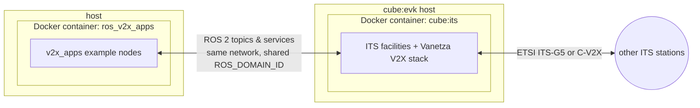
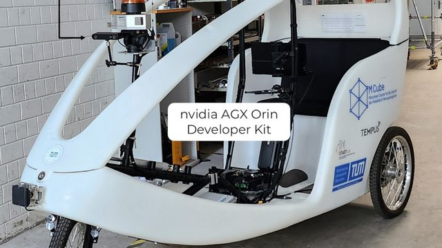
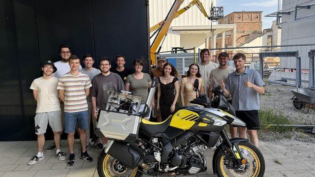

# V2X application examples for cube:its

`v2x_apps` is a collection of **ready-to-run examples** for building your own **V2X** (Vehicle-to-Everything) application on [*cube:its*](https://www.nfiniity.com/docs/dev/stacks/cube-its/intro/), in a [ROS 2](https://www.ros.org/) environment. In V2X, vehicles, roadside infrastructure, and vulnerable road users exchange standardized **ITS messages** in real time. Each example here sends or receives one such message type through cube:its.

*cube:its* runs on the [cube:evk](https://www.nfiniity.com/#hardware-section). Your `v2x_apps` examples run in their own Docker container, on the cube:evk itself or any other host on the same network. As long as both share the same DDS domain (`ROS_DOMAIN_ID`, with `ROS_LOCALHOST_ONLY=0`), their nodes discover each other and exchange ITS messages over ROS 2 topics and services. *cube:its* handles the actual ETSI ITS-G5 or C-V2X transmission via its ITS facilities and the Vanetza stack, while your nodes only produce and consume the ROS messages.


```mermaid
flowchart LR
    subgraph dev["host"]
        subgraph d2["Docker container: ros_v2x_apps"]
            apps["v2x_apps example nodes"]
        end
    end
    subgraph evk["cube:evk host"]
        subgraph d1["Docker container: cube:its"]
            cits["ITS facilities + Vanetza V2X stack"]
        end
    end
    apps <-->|"ROS 2 topics & services<br/>same network, shared ROS_DOMAIN_ID"| cits
    cits <-->|"ETSI ITS-G5 or C-V2X"| ext(("other ITS stations"))
```

A rough architecture of *cube:its* itself is shown in the [cube:its overview](docs/cube-its.md).

---

## Getting started

These steps assume a running [cube:its](docs/cube-its.md) instance on a [cube:evk](https://www.nfiniity.com/#hardware-section).

1. **Clone the repository and open it in the devcontainer.**

   ```bash
   git clone https://github.com/cubesys-GmbH/ros_v2x_apps.git
   ```

   Open the folder in VSCode and reopen it in the container when prompted.

2. **Build the package** from the workspace root.

   ```bash
   cd dev_ws
   source /opt/cube/*/setup.bash   # ROS 2 + cube:its environment
   colcon build --packages-select v2x_apps
   ```

3. **Source the overlay** so the executables are on your path.

   ```bash
   source install/setup.bash
   ```

4. **Enable discovery** so `v2x_apps` and *cube:its* can see each other. By default `ROS_LOCALHOST_ONLY=1` hides nodes from other ROS 2 environments on the network. Set it to `0` and make sure both share the same `ROS_DOMAIN_ID` (default `42`).

   ```bash
   export ROS_LOCALHOST_ONLY=0
   export ROS_DOMAIN_ID=42        # must match cube:its
   ```

   More on [domain IDs](https://docs.ros.org/en/humble/Concepts/Intermediate/About-Domain-ID.html).

5. **Run a node** (`cam_listener` here).

   ```bash
   ros2 run v2x_apps cam_listener
   ```

   Available nodes: `cam_listener`, `denm_node`, `cpm_provider`, `vam_provider`, `btp_listener`, `btp_sender`, `stationary_vehicle`.

The node started correctly when you see:

```
[INFO] [1706013094.349399714] [cam_listener]: Node "cam_listener" started
```

It then waits for CAMs from *cube:its*. Once they arrive:

```
[INFO] [1706013095.341824275] [cam_listener]: Received CAM from Station Id: 84281098
[INFO] [1706013096.345854233] [cam_listener]: Received CAM from Station Id: 84281098
[INFO] [1706013097.345731609] [cam_listener]: Received CAM from Station Id: 84281098
```

For more examples, with a diagram and topic/service breakdown per node, see [Code examples](docs/code_examples.md).

---

## Repository structure

The package lives under `dev_ws/src/v2x_apps`. Each node is a self-contained example of one ITS message type:

```bash
dev_ws
└── src/v2x_apps
    ├── package.xml
    ├── setup.cfg
    ├── setup.py
    ├── v2x_apps                            # ROS 2 example nodes
    │   ├── btp_listener.py                 # receive raw BTP messages
    │   ├── btp_sender.py                   # send raw BTP messages
    │   ├── cam_listener.py                 # receive CAMs
    │   ├── cpm_provider.py                 # provide CPMs
    │   ├── denm_node.py                    # send & receive DENMs
    │   └── vam_provider.py                 # provide VAMs
    ├── c2c
    │   └── stationary_vehicle_trigger.py   # Stationary Vehicle Warning trigger
    └── test
        └── test_value_scaling.py
```

---

## Run tests

From the root of the workspace, build and test:

```
colcon build --packages-select v2x_apps
colcon test --packages-select v2x_apps
colcon test-result --all --verbose
```

---

## Real-world deployments

The cube:evk and the cube:its stack are used in V2X research and product projects across academia and industry. A few examples:

<table>
  <tr>
    <td width="50%" align="center">
      <a href="https://www.nfiniity.com/blog/UniTrento-Bike-Safety.html"></a><br/>
      <b>Bike safety in mountain environments</b><br/>University of Trento
    </td>
    <td width="50%" align="center">
      <a href="https://www.nfiniity.com/blog/TUM-Enhancing-Urban-Mobility.html"></a><br/>
      <b>Enhancing urban mobility</b><br/>TU München
    </td>
  </tr>
  <tr>
    <td width="50%" align="center">
      <a href="https://www.nfiniity.com/blog/THI-Group-Riding-Enhanced-By-C-ITS.html"></a><br/>
      <b>Group riding enhanced by C-ITS</b><br/>Technische Hochschule Ingolstadt
    </td>
    <td width="50%" align="center">
      <a href="https://www.nfiniity.com/insights.html#related-stories"></a><br/>
      <b>A new safety concept for cars and motorcycles</b><br/>Lamborghini and Ducati
    </td>
  </tr>
</table>

More case studies and demos at [nfiniity insights](https://www.nfiniity.com/insights.html).
