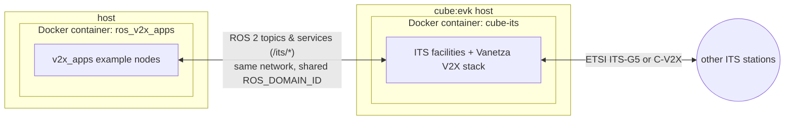

# V2X application examples for cube-its

This repository provides examples demonstrating how to develop and run your own V2X (Vehicle-to-Everything) application on the [*cube-its*](https://www.nfiniity.com/docs/dev/stacks/cube-its/intro/) within a [ROS 2 (Robot Operating System)](https://www.ros.org/) environment.

*cube-its* runs on the [cube:evk](https://www.nfiniity.com/#hardware-section) host. Your `v2x_apps` examples run in their own Docker container, on the cube:evk itself or on any other host. As long as both are on the same network and share the same DDS domain (`ROS_DOMAIN_ID`, with `ROS_LOCALHOST_ONLY=0`), their nodes discover each other and exchange ITS messages over ROS 2 topics and services. *cube-its* runs the ITS facilities and the Vanetza V2X stack, so it handles the actual ETSI ITS-G5 or C-V2X transmission to and from other stations, while your nodes only produce and consume the ROS messages.


```mermaid
flowchart LR
    subgraph dev["host"]
        subgraph d2["Docker container: ros_v2x_apps"]
            apps["v2x_apps example nodes"]
        end
    end
    subgraph evk["cube:evk host"]
        subgraph d1["Docker container: cube-its"]
            cits["ITS facilities + Vanetza V2X stack"]
        end
    end
    apps <-->|"ROS 2 topics & services (/its/*)<br/>same network, shared ROS_DOMAIN_ID"| cits
    cits <-->|"ETSI ITS-G5 or C-V2X"| ext(("other ITS stations"))
```

---

## Repository structure

The package lives under `dev_ws/src/v2x_apps`. Each node is a self-contained example of one ETSI ITS message type:

```bash
dev_ws
└── src/v2x_apps
    ├── package.xml
    ├── setup.cfg
    ├── setup.py
    ├── v2x_apps                            # ROS 2 example nodes
    │   ├── btp_listener.py                 # receive raw BTP messages
    │   ├── btp_sender.py                   # send raw BTP messages
    │   ├── cam_listener.py                 # receive CAMs
    │   ├── cpm_provider.py                 # provide CPMs
    │   ├── denm_node.py                    # send & receive DENMs
    │   └── vam_provider.py                 # provide VAMs
    ├── c2c
    │   └── stationary_vehicle_trigger.py   # Stationary Vehicle Warning trigger
    └── test
        └── test_value_scaling.py
```

## Getting started

These steps assume a running [cube-its](docs/cube-its.md) instance on a [cube:evk](https://www.nfiniity.com/#hardware-section).

1. **Clone the repository and open it in the devcontainer.**

   ```bash
   git clone https://github.com/cubesys-GmbH/ros_v2x_apps.git
   ```

   Open the folder in VSCode and reopen it in the container when prompted.

2. **Build the package** from the workspace root.

   ```bash
   cd dev_ws
   colcon build --packages-select v2x_apps
   ```

3. **Source the overlay** so the executables are on your path.

   ```bash
   source install/setup.bash
   ```

4. **Enable discovery** so `v2x_apps` and *cube-its* can see each other. By default `ROS_LOCALHOST_ONLY=1` hides nodes from other ROS 2 environments on the network. Set it to `0` and make sure both share the same `ROS_DOMAIN_ID` (default `42`).

   ```bash
   export ROS_LOCALHOST_ONLY=0
   export ROS_DOMAIN_ID=42        # must match cube-its
   ```

   More on [domain IDs](https://docs.ros.org/en/humble/Concepts/Intermediate/About-Domain-ID.html).

5. **Run a node** (`cam_listener` here); see [Code examples](docs/code_examples.md) for what each one does.

   ```bash
   ros2 run v2x_apps cam_listener
   ```

   Available nodes: `cam_listener`, `denm_node`, `cpm_provider`, `vam_provider`, `btp_listener`, `btp_sender`, `stationary_vehicle`.

The node started correctly when you see:

```
[INFO] [1706013094.349399714] [cam_listener]: Node "cam_listener" started
```

It then waits for CAMs from *cube-its*. Once they arrive:

```
[INFO] [1706013095.341824275] [cam_listener]: Received CAM from Station Id: 84281098
[INFO] [1706013096.345854233] [cam_listener]: Received CAM from Station Id: 84281098
[INFO] [1706013097.345731609] [cam_listener]: Received CAM from Station Id: 84281098
```

👉 For more examples, with a diagram and topic/service breakdown per node, see [Code examples](docs/code_examples.md).

---

## Run tests

From the root of the workspace, build and test:

```
colcon build --packages-select v2x_apps
colcon test --packages-select v2x_apps
colcon test-result --all --verbose
```

---

## Real-world deployments

Explore real-world scenarios that show how end users apply our technology in practical conditions.

👉 [Check out related use cases and demos](https://www.nfiniity.com/knowledge.html) 
