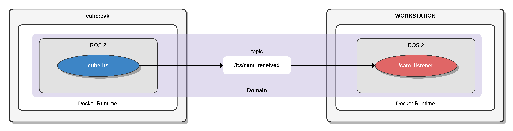
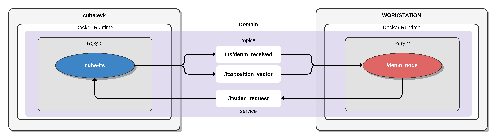
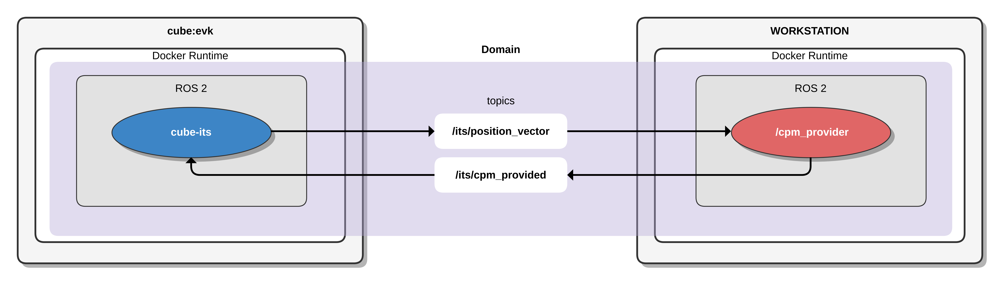

# Code examples

- [Cooperative Awareness Message (CAM)](#cooperative-awareness-message)
- [Decentralized Environmental Notification Message (DENM)](#decentralized-environmental-notification-message)
- [Collective Perception Message (CPM)](#collective-perception-message)
- [Vulnerable Road User Awareness Message (VAM)](#vulnerable-road-user-awareness-message)
- [Stationary Vehicle Warning (StVeWa)](#stationary-vehicle-warning-trigger)

## Cooperative Awareness Message

The [*cam_listener*](https://github.com/cubesys-GmbH/ros_v2x_apps/blob/master/dev_ws/src/v2x_apps/v2x_apps/cam_listener.py), depicted in Figure 2, monitors for received Cooperative Awareness Messages (CAMs) sent through the designated published topic */its/cam_received* by *cube-its*. Within the *cube-its* framework, the publication of received CAM data is managed, while the *cam_listener* node is set up to subscribe to this particular topic. This setup allows the *cam_listener* node to receive and process CAM data, highlighting a key aspect of the project's functionality.

The *cam_listener* node operates within a Docker container, similar to the *cube-its*. Both are functioning within a ROS 2 environment and share the same domain, facilitating the ability of ROS 2 nodes to discover each other.

## Decentralized Environmental Notification Message

The [*denm_node*](https://github.com/cubesys-GmbH/ros_v2x_apps/blob/master/dev_ws/src/v2x_apps/v2x_apps/denm_node.py), illustrated in Figure 3, handles the transmission and reception of Decentralized Environmental Notification Messages (DENMs) via *cube-its*. It subscribes to specific topics to receive position updates and incoming DENMs, and it utilizes a service call to initiate the transmission of DENMs. Furthermore, the denm_node periodically generates and sends DENMs based on its current location.

**Subscriptions:**
- **/its/position_vector:** The *denm_node* subscribes to this topic to receive regular updates about the current position.
- **/its/denm_received:** This subscription allows the *denm_node* to receive incoming DENMs from other V2X capable stations. By processing these messages, the node can react to various environmental events and updates.

**Services:**
- **/its/den_request:** The *denm_node* can use this service to request the transmission of a DENM. This is likely an on-demand feature, where a specific condition or event triggers the need to send a DENM immediately. Here, in this example the transmission is called periodically.

## Collective Perception Message

In the following example, we regularly create a Collective Perception Message (CPM) that includes sample Perceived Object data and transmits it based on the current position. The [*cpm_provider*](https://github.com/cubesys-GmbH/ros_v2x_apps/blob/master/dev_ws/src/v2x_apps/v2x_apps/cpm_provider.py), illustrated in Figure 4, is tasked with supplying CPMs to *cube-its*. It subscribes to receive position updates and publishes a CPM to the */its/cpm_provided* topic, where the CPS facility in *cube-its* handles the transmission of the CPM. Furthermore, it consistently generates and sends CPMs according to the current position.

**Subscriptions:**
- **/its/position_vector:** The *cpm_provider* subscribes to this topic to receive continuous updates regarding the current position.

**Publisher:**
- **/its/cpm_provided:** The *cpm_provider* provides the generated CPM to *cube-its* on this topic for transmission.

## Vulnerable Road User Awareness Message

In the following example, we regularly create a Vulnerable Road User Awareness Message (VAM) that includes sample vulnerable user data and transmits it based on the current position. The [*vam_provider*](https://github.com/cubesys-GmbH/ros_v2x_apps/blob/master/dev_ws/src/v2x_apps/v2x_apps/vam_provider.py), shown in Figure 5, is responsible for delivering VAMs to *cube-its*. It subscribes to receive position updates and publishes a VAM to the */its/vam_provided* topic, where the VA facility in *cube-its* handles the transmission of the VAM. Furthermore, it consistently generates and sends VAMs according to the current position.

**Subscriptions:**
- **/its/position_vector:** The *vam_provider* subscribes to this topic to receive continuous updates regarding the current position.

**Publisher:**
- **/its/vam_provided:** The *vam_provider* provides the generated VAM to *cube-its* on this topic for transmission.

## Stationary Vehicle Warning Trigger

")

The [*stationary_vehicle*](https://github.com/cubesys-GmbH/ros_v2x_apps/blob/master/dev_ws/src/v2x_apps/c2c/stationary_vehicle_trigger.py), depicted in Figure 6, initiates a Stationary Vehicle Warning (StVeWa) using the facility service on cube-its.
In this scenario, our client application, *stationary_vehicle*, sends a single request in order to trigger StVeWa, which is acknowledged by a response from the facility service.
Upon successfully triggering the warning, *cube-its* continuously transmits the StVeWa message, a DENM message profiled by [C2C-CC](https://www.car-2-car.org/), until the facility service processes a termination request.

**Services:**
- **/c2c/stationary_vehicle_request:** The *stationary_vehicle* can use this service call to trigger or terminate a stationary vehicle warning on *cube-its*.
