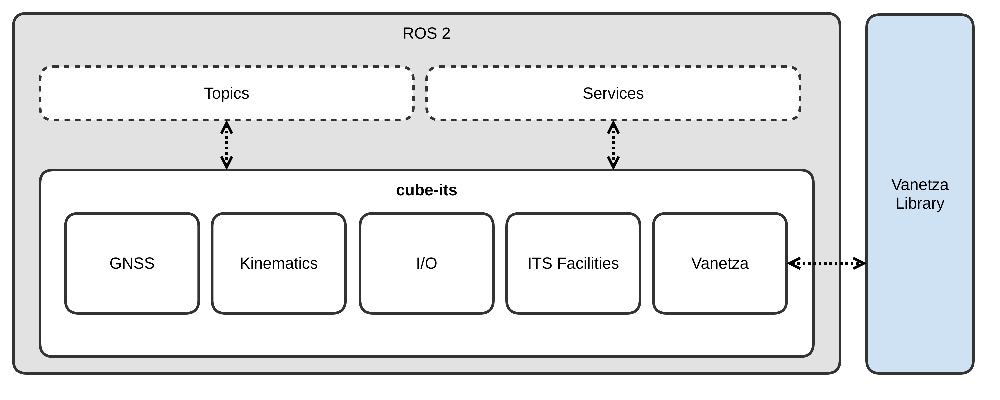

# cube:its  

The **[cube:its](https://www.nfiniity.com/docs/dev/stacks/cube-its/intro/)** framework integrates Intelligent Transportation Systems (ITS) applications and Vehicle-to-Everything (V2X) communication within a ROS 2 environment. It handles data exchange between vehicles and external entities such as other vehicles, infrastructure, pedestrians, and cloud systems.

Its nodes collaboratively handle GNSS data, vehicle kinematics, I/O, ITS facilities, and V2X communication via the [Vanetza](https://www.vanetza.org/) library, as illustrated in Figure 1.

## Component description

| Component | Description |
| --- | --- |
| GNSS | Provides accurate global positioning data for the system. It reads data from GNSS receiver and provides the position, velocity, and time information. | 
| Kinematics | Computes the kinematic state of the system based on GNSS data and other sensors. It calculates the system's pose, velocity, and acceleration. | 
| I/O | Handles sensor inputs and actuator outputs. It processes data from various sensors or interfaces such as CAN (Controller Area Network). | 
| ITS Facilities | Provides services and functionalities for intelligent transportation systems, including communication with traffic infrastructure and managing V2X communication. | 
| Vanetza | Facilitates V2X communication by implementing the **[ETSI (European Telecommunications Standards Institute)](https://www.etsi.org) ITS-G5** protocol for vehicle and infrastructure communication. | 

## Interfaces

The [`ros_cube_msgs`](https://github.com/cubesys-GmbH/ros_cube_msgs) package provides a set of ROS message and service definitions for interacting with cube:its, forming part of the public API. The package includes the following:

| Name | Description |
| --- | --- |
| cube_ca_msgs | Interface for Cooperative Awareness (CA) | 
| cube_den_msgs | Interface for Decentralized Environmental Notification (DEN) | 
| cube_cp_msgs | Interface for Collective Perception (CP) | 
| cube_va_msgs | Interface for Vulnerable Road Users Awareness (VA) |
| cube_facility_msgs | Interface supporting ITS facilities|
| cube_msgs | General interface for cube settings and parameters |

## Compatible ETSI ITS messages

The *cube:its* framework incorporates the [`etsi_its_messages`](https://github.com/ika-rwth-aachen/etsi_its_messages) package to facilitate the use of standardized ITS messages for V2X communication within ROS and ROS 2 environments. This integration enables developers to implement and manage V2X communication protocols, adhering to the ETSI specifications, within robotic and autonomous vehicle systems.

| Status | Acronym | Name | EN Specification | TS Specification | Supported in cube:its |
| --- | --- | --- | --- | --- | --- |
| :white_check_mark: | CAM | Cooperative Awareness Message | [EN 302 637-2 V1.4.1](https://www.etsi.org/deliver/etsi_en/302600_302699/30263702/01.04.01_60/en_30263702v010401p.pdf) ([ASN.1](https://forge.etsi.org/rep/ITS/asn1/cam_en302637_2)) | - | >=v1.0.0 |
| :white_check_mark: | DENM | Decentralized Environmental Notification Message | [EN 302 637-3 V1.3.1](https://www.etsi.org/deliver/etsi_en/302600_302699/30263703/01.03.01_60/en_30263703v010301p.pdf) ([ASN.1](https://forge.etsi.org/rep/ITS/asn1/denm_en302637_3)) | - | >=v1.0.0 |
| :white_check_mark: | CPM | Collective Perception Message | - | [TS 103 324 V2.1.1](https://www.etsi.org/deliver/etsi_ts/103300_103399/103324/02.01.01_60/ts_103324v020101p.pdf) ([ASN.1](https://forge.etsi.org/rep/ITS/asn1/cpm_ts103324)) | >=v1.2.0 |
| :white_check_mark: | VAM | Vulnerable Road User Awareness Message | - | [TS 103 300-3 V2.2.1](https://www.etsi.org/deliver/etsi_ts/103300_103399/10330003/02.02.01_60/ts_10330003v020201p.pdf) | >=v1.3.0 |
| :soon: | MAPEM | Map Extended Message | - | [TS 103 301 V2.1.1](https://www.etsi.org/deliver/etsi_ts/103300_103399/103301/02.01.01_60/ts_103301v020101p.pdf) ([ASN.1](https://forge.etsi.org/rep/ITS/asn1/is_ts103301/-/tree/v2.1.1?ref_type=tags)) | - |
| :soon: | SPATEM | Signal Phase and Timing Extended Message | - | [TS 103 301 V2.1.1](https://www.etsi.org/deliver/etsi_ts/103300_103399/103301/02.01.01_60/ts_103301v020101p.pdf) ([ASN.1](https://forge.etsi.org/rep/ITS/asn1/is_ts103301/-/tree/v2.1.1?ref_type=tags)) | - |

## Conformance validation

The *cube:its* framework is validated using the ETSI conformance validation framework, as specified in [ETSI TR 103 099 V1.5.1](https://www.etsi.org/deliver/etsi_tr/103000_103099/103099/01.05.01_60/tr_103099v010501p.pdf).

## Supported applications

This section provides an overview of the supported applications profiled and specified by various C-ITS platforms and consortia, including [C-ROADS](https://www.c-roads.eu/platform.html), the [Car-2-Car Communication Consortium (C2C-CC)](https://www.car-2-car.org/), the [Connected Motorcycle Consortium (CMC)](https://www.cmc-info.net/), and others.
For simplicity, the implementation of triggering conditions is omitted here due to the lack of in-vehicle information.

Please note that application profiling can always be achieved by configuring the specified message values and applying the appropriate trigger conditions. Examples of how to configure the values for various messages, such as DENM, CPM, VAM etc. can be found in [code examples](code_examples.md).

| Status | Acronym | Name | Specification | Supported in cube:its |
| --- | --- | --- | --- | --- |
| :white_check_mark: | StVeWa | Triggering Conditions and Data Quality Stationary Vehicle Warning | [C2C-CC RS 2006 Stationary Vehicle R1.6.7](https://www.car-2-car.org/fileadmin/documents/Basic_System_Profile/Release_1.6.7/C2CCC_RS_2006_StationaryVehicle_R167.pdf) | >=v1.3.0 |
